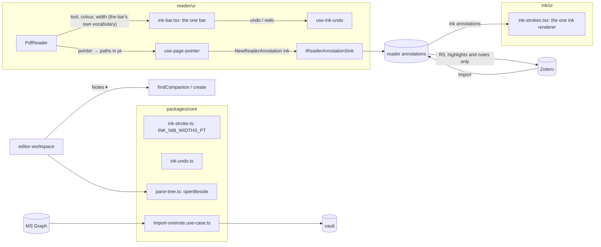

# PDF ink: a pen rail on the paper, a note beside it, OneNote in

**Status:** working · **Branch:** `feat/pdf-ink` (worktree off `main`) · **Written:** 2026-09-18

What a tablet PDF reader does: open a paper, pick a pen, write on the page
exactly where you want — a bracket beside a paragraph, a word in the margin,
a highlighter stroke over a sentence — and have it stay there through zoom,
rotation, reopening and Zotero sync. Then a place to write *beside* the paper:
a text or ink note split next to the PDF, linked to it. And the notes the user
already has in OneNote, brought in as WeaveForge notes.

**The reader can already write on the page.** `pdf-reader.tsx` has the tools
Draw freehand / Highlighter pen / Erase ink; a stroke is a `ReaderAnnotation`
of `type: "ink"` in Zotero's own shape (`anchor.zoteroPosition.paths`, one
`width` in PDF points), stored through `IReaderAnnotationSink`, listed in the
annotation sidebar next to the Zotero-imported ones, and written back by R5.
Zotero's ink annotations import through the same type. So the model, the
storage, the projection and the sync exist. What is missing is the *pen
experience*: the tools hide in a `<select>`, there is one nib, no undo, no
colour swatches, and a paper tab in the workspace has no mode that says
"I am writing on this". This plan adds that experience over the existing
model, then the companion note, then OneNote import. It does **not** add a
second ink store: a stroke on a PDF is a reader annotation, full stop, so it
stays a Zotero annotation.

---

## 0. Ground rules for the agent

- Read `docs/building/design.md` §3–4 first. Feature-module shape, dependencies
  inward only, no SDK/HTTP/DOM in `packages/core`.
- Read before writing:
  `packages/core/src/reader/reader-annotation.ts` (the annotation model, the
  sink port), `packages/core/src/reader/ink-stroke.ts` (`clampInkWidth`,
  `inkWidthForPressure`, `INK_DEFAULT_WIDTH`, point caps),
  `packages/core/src/reader/zotero-write-back.ts` (what R5 syncs — ink is in),
  `apps/web/src/features/reader/ui/pdf-reader/pdf-reader.tsx` (`createTool`,
  `createColor`, `canCreate`, the tool `<select>` near line 630, the page loop
  near line 730), `apps/web/src/features/reader/ui/pdf-reader/use-page-pointer.ts`
  (ink capture, `endInkGroup`, the shared `InkPenGate`),
  `apps/web/src/features/reader/ui/annotation-overlay.tsx` (how a stored
  stroke is drawn: `pdf-reader-ink`, `--highlighter`, width in PDF units),
  `apps/web/src/features/reader/application/draft-local-annotation.ts`,
  `apps/web/src/features/reader/ui/paper-pdf-pane.tsx` (`onAnnotationsChange`,
  the `aside` slot), `apps/web/src/features/ink/ui/ink-bar.tsx` (the ink
  note's tool bar: `INK_BAR_TOOLS`, `nibForTool`, `InkBar`),
  `packages/core/src/ink/width.ts` (the ink note's nib set),
  `apps/web/src/features/editor-workspace/application/pane-tree.ts`
  (`splitPane`, `openTab`, `setTabMode`, `DocumentMode`) and
  `apps/web/src/features/editor-workspace/ui/kind.ts`.
- Pure logic goes in `packages/core` with tests under `packages/core/test/`;
  hooks and components in `apps/web`. Nothing over 800 lines
  (`npm run check:hygiene`); split into sibling modules.
- Match the surrounding comment density and voice: comments say *why*, in
  prose, and name the rule of `docs/building/design.md` they serve.
- Per phase: `npm run build -w packages/core`, `npm test -w packages/core`,
  `npm test -w apps/web`, `npx tsc --noEmit -p tsconfig.json` in `apps/web`,
  `npm run check:boundaries` and `npm run check:hygiene` at the root, then one
  signed commit (`git commit -s`, conventional subject, ending
  `Co-Authored-By: Claude Opus 5 <noreply@anthropic.com>`).
- Verify in the installed desktop app over CDP, not by asking the user: the
  loop is in the project memory (`desktop-cdp-verify`): build, silent
  install, launch with `--remote-debugging-port=9222`, drive, screenshot.
- Generate docs (`npm run docs:generate`) from the tracked tree only (stash
  untracked files first): the generator counts every file it sees, and CI has
  no scratch files.

---

## 1. Design

### 1.1 What the user sees

```
┌──────────────────────────────────────────────────────────────────────────────┐
│ Explorer │ ◂ lippe-2023.pdf ▸   [Edit] [Read] [PDF] [Ink]      [Notes ▾]  ⋯ │
│          ├─────────────────────────────────────────────┬──────────┬─────────┤
│ ▸ Papers │                                             │ Annot.   │  ↶  ↷   │
│   ▸ Lippe│   ┌──────────────────────────────────┐      │ ▤ Zotero │  ↖ sel  │
│     23   │   │  Figure 2: A representation ...  │      │  hl p.1  │  ○ lasso│
│     ↳ 📝 │   │  ┌────┐       ┌────┐             │      │  ink p.1 │  ────── │
│     ↳ ✒  │   │  │ X  │       │ X  │   ⌒⌒ graph │      │ ▤ Mine   │  ✒ pen  │
│          │   │  └────┘       └────┘   ~~~~~~   │      │  ink p.1 │  ▬ hi   │
│          │   │  ...                             │      │  hl p.2  │  ◻ erase│
│          │   │  ████ (highlighter, multiply) ██ │      │          │  ────── │
│          │   │  dependencies on the previous... │      │          │ ●●●● +  │
│          │   └──────────────────────────────────┘      │          │ nib ▂▄▆█│
│          │   ┌──────────────────────────────────┐      │          │  ✕      │
│          └───┴──────────────────────────────────┴──────┴──────────┴─────────┘
│ status: p. 1 / 12 · pen 1.4 pt · 14 annotations · 3 pending sync                │
└──────────────────────────────────────────────────────────────────────────────┘
```

- A paper tab gains a fourth mode, **Ink**, beside Edit / Read / PDF. It is
  the PDF view with the pen rail docked at the right and the pen armed. PDF
  mode is unchanged (ink visible, tools in the toolbar as today); Ink mode is
  "the rail is out and the pen is in my hand". Both show the same annotations:
  Zotero's and the user's, in the sidebar, as today.
- The **pen rail**: undo · redo · select · lasso · pen · highlighter · eraser
  · colour swatches (last 4 used + picker) · nib sizes (4) · close. Same
  layout as the ink note's `InkBar` in its vertical form — same component
  where it can be, same icons and tokens everywhere.
- **Notes ▾** on a paper tab: *Text beside* · *Ink beside* · *Side: right /
  below* · *Copy page link*. Opens the paper's companion note in a split next
  to the PDF (§1.3). `Ctrl+Shift+N` = Text beside.

```
┌──────────────────────────────────────────────────────────────────────────────┐
│ ◂ lippe-2023.pdf [Ink] ▸                │ ◂ Notes — Lippe 2023 [Ink] ▸       │
│ ┌────────────────────────────────┐      │ ┌─────────────────────────────┐   │
│ │  PDF page with ink over it     │      │ │ ruled sheet                  │   │
│ │                                │      │ │  ~ the graph is a DBN ~      │   │
│ └────────────────────────────────┘      │ └─────────────────────────────┘   │
└──────────────────────────────────────────────────────────────────────────────┘
```

### 1.2 The stroke stays a reader annotation

Nothing changes in the model. A pen stroke is `NewReaderAnnotation{type:
"ink", color, anchor.zoteroPosition.{pageIndex, paths, width}}`, created
through `onAnnotationsChange` → `IReaderAnnotationSink`, so it:

- sits beside Zotero's imported ink in the sidebar and on the page
  (`origin: "local"` vs `"zotero"`);
- is written back to Zotero by R5 when the library is `bidirectional`, and a
  Zotero ink annotation edited elsewhere comes back through the same merge;
- is anchored in PDF points, so zoom and rotation are the reader's
  projection (`project-annotation-geometry.ts`), already tested.

What the rail adds is state around creation, not a new record:

- **Nib set** — four widths in PDF points. Match the ink note's feel
  (`packages/core/src/ink/width.ts` is 0.1 / 0.3 / 0.5 / 0.7 mm): in points
  that is 0.28 / 0.85 / 1.42 / 1.98, default 1.42. Add
  `INK_NIB_WIDTHS_PT` next to `clampInkWidth` in
  `packages/core/src/reader/ink-stroke.ts` and derive it from the ink set
  (`mm × 72 / 25.4`), tested, so the two never drift. Highlighter keeps its
  own nib as `ink-bar.tsx` does (`HIGHLIGHTER_NIB`).
- **Undo / redo** — a stack of `{created: id}` / `{removed: annotation}` over
  ink creates and erases in this session, in a new hook
  `apps/web/src/features/reader/ui/pdf-reader/use-ink-undo.ts`; undo of a
  create is `remove(id)`, undo of an erase is `create(draft)` with the same
  anchor. Pure stack in `packages/core/src/reader/ink-undo.ts` (new), tested.
  `Ctrl+Z` / `Ctrl+Shift+Z` while the rail is open.
- **Colours** — the reader's `createColor` plus the last four used, kept in
  the reader's preferences the way `use-ink-prefs.ts` keeps the ink note's.
- **Tool memory** — the rail's tool, colour and nib persist per user (not
  per paper).

### 1.3 The companion note

- A vault page or ink note whose header carries `paper: <paperId>`
  (frontmatter on a text note; `ink-paper:` header key on an ink note, new in
  `packages/core/src/ink/ink-note.ts`). Title `Notes — <paper title>`; created
  on first request, opened after. `findCompanion(paperId, kind)` on the vault
  indexes the key — no full-body scan per call.
- Explorer nests companions under the paper (`workspace-tree.ts`): 📝 text,
  ✒ ink.
- Split = `splitPane(layout, paneId, side)` + `openTab`, both in
  `pane-tree.ts`; add `openBeside(layout, tab, side)` there so the sequence is
  one pure, tested operation. Side remembered in preferences, default right,
  ratio 0.55.
- A text companion is born with the paper's wikilink on its first line; *Copy
  page link* on the PDF toolbar (`buildLocusLink` exists) gives a link into a
  page. Stretch: selection → *Quote to note* appends `> …` with the link.

### 1.4 OneNote import

Two doors, in order of value:

1. **Microsoft Graph** (`/me/onenote/pages/{id}/content?includeInkML=true`):
   the page's HTML plus an InkML part for handwriting. An integration in the
   shape of Zotero's (`integration-descriptors.ts`,
   `user-integration-credentials.ts`, an OAuth code flow through the
   desktop's browser window, tokens in `secretStore()`). Import maps:
   - page HTML → a vault page (Markdown through the existing HTML→MD path
     the clipboard import uses; images → attachments);
   - InkML traces → strokes of an ink note (InkML units are himetric, 0.01
     mm; the ink note is 0.1 mm — divide by 10; pressure channel → width);
   - section / notebook → folders; OneNote page title → note title; the
     OneNote page id in frontmatter (`onenote: <id>`) so a re-import updates
     instead of duplicating.
2. **Files** — `.one` is a closed binary; do not parse it. Accept a folder of
   OneNote *exports* instead: PDF (→ paper, then §1.2 works on it) and
   `.docx` (→ vault page via the docx path if one exists, else skip with a
   message). This is the door that needs no account.

The importer is a use case in `packages/core` (`importOneNotePage(page,
ink)` → `{notes, inkNotes}`, pure, tested on fixture HTML + InkML), fed by
an `apps/web` infrastructure client. Settings gets an *Import from OneNote*
panel next to the Zotero one; progress and skips are listed, nothing is
silent.

### 1.5 Components and data flow



- **Built as one bar, not two.** The reader renders the ink note's
  `InkBar` (`apps/web/src/features/ink/ui/ink-bar.tsx`) rather than a `PenRail`
  of its own: the note hands it the whole of its state, the reader the pen's,
  and a section whose props are absent is not drawn. The reader's tools are the
  bar's under their own names — `select` is the lasso, `ink` the pen, `erase`
  the eraser (`use-pen-prefs.ts` maps them), the colour is an ink colour *name*
  resolved through the palette, and the nib is the note's 0.1 mm converted once
  (`inkNoteWidthToPdfPoints`). No `Done` button: the reader's own *Pen* toggle
  puts the pen down.
- **One ink renderer.** A paper's strokes are drawn by
  `apps/web/src/features/ink/ui/ink-strokes.tsx`, the same component the note's
  static pages use, so the path builder, caps, joins and highlighter tint are
  the note's. Text highlights keep their own DOM renderer
  (`annotation-overlay.tsx`): a highlight is a rectangle of the page's own text
  and has nothing in common with a pen line.
- Ink is **not** written back to Zotero (`zoteroWriteBackAnnotations`): only
  highlights, underlines, notes and clipped regions are. Nor is it *created*
  outside ink mode: the reader's tool picker offers highlight text, clip a region
  and write a note, and the three ink tools belong to the pen bar. With the pen
  away the marks are drawn and read-only — a pen or a finger goes to the page's
  own text, not to a stroke lying over it — and a paper's ink is to be synced
  from the ink notes rather than written here in a second vocabulary.
- `PaperPdfPane` gets `inkRail?: boolean`; `document-host.tsx` passes it for
  the paper tab's new mode `ink`. The `/reader` route gets a *Pen* toggle in
  its toolbar that shows the same rail.

---

## 2. Phases

Each phase ends green, committed, and (from phase 1) verified over CDP with a
screenshot in the PR comment.

### Phase 1 — the pen bar
- `INK_NIB_WIDTHS_PT`, `ink-undo.ts` in core, tests.
- The reader renders the ink note's `InkBar` (§1.5) with `use-ink-undo.ts`; the
  tool `<select>` stays for PDF mode, the bar replaces it when the pen is out;
  colour swatches; nib buttons set the width that `use-page-pointer.ts` hands
  to `inkWidthForPressure`.
- Ink drawn through `InkStrokes` (§1.5), and not written back to Zotero.
- Paper tab mode `ink` in `pane-tree.ts` `DocumentMode`, `kind.ts`
  (`ink: true` for `paper`), the mode button in `pane-view.tsx`;
  `PaperPdfPane inkRail`; `/reader` *Pen* toggle.
- CDP check: open a paper, Ink mode, pick red + nib 3, draw a bracket at a
  known word's rect (`.pdf-reader-textlayer` spans give word boxes), undo,
  redo, zoom 50→200 %, reload; assert the stroke's SVG path bbox still
  overlaps the word's rect, and the sidebar lists it under *Mine* beside the
  Zotero ones.

### Phase 2 — beside
- `openBeside`, companion header keys, `findCompanion`, explorer nesting,
  `Notes ▾`, side preference, `Ctrl+Shift+N`, *Copy page link*.
- CDP check: Text beside → split appears, note titled `Notes — …`, first line
  is the paper's wikilink; Ink beside → ruled sheet in the split, a stroke
  saves and survives reload.

### Phase 3 — OneNote import
- Core use case + fixtures first (HTML with headings, lists, an image, a
  table; InkML with two traces and pressure).
- Graph client + OAuth in the shape of Zotero's integration; Settings panel;
  file-export door.
- CDP check: import a fixture served from a local stub of the Graph endpoint;
  assert one vault page and one ink note appear, ink note has two strokes,
  second import of the same page updates in place.

### Phase 4 — polish (only if time)
- *Quote to note*. Lasso on PDF ink (select several ink annotations, move or
  recolour together — `batch-annotation-ops.ts` has the batch shape).
  Recognition of PDF ink into the companion's "margin notes" section.

---

## 3. Not in scope

- A second ink store for PDF strokes. If the reader's ink needs something,
  it goes into `ReaderAnnotation` and R5, so Zotero sees it too.
- Parsing `.one` files.
- Rasterising the PDF into an ink note as a background (that import exists
  for freestanding notes and stays as it is).
